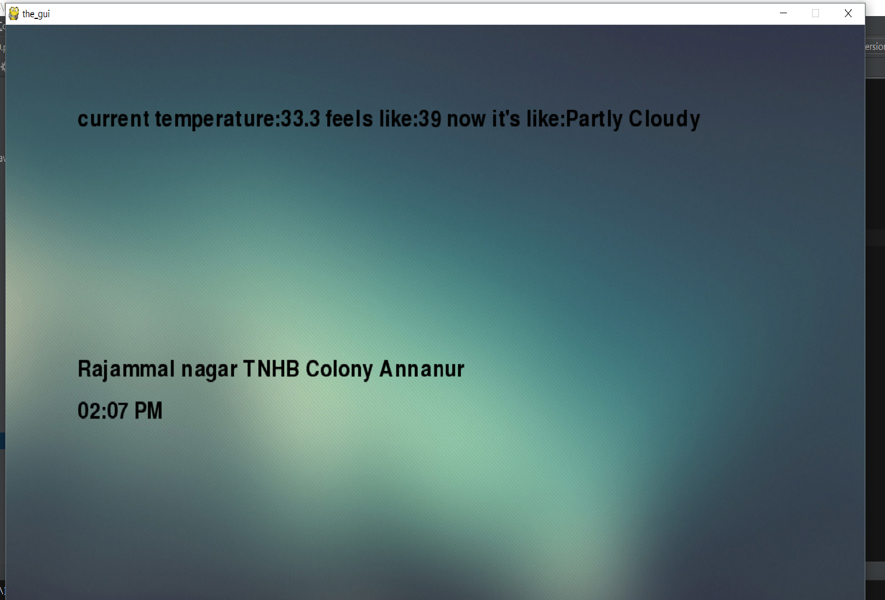

<h1>
RAEES
</h1>

**Rule-based Assistant and Explicitly Extensible System.**
* *struggled to come up with it*

A gui assisstant for weather and maps using APIs
Requires python and libraries such as googlemaps, json, sqlite3, pyttsx and some inbuilt libraries.
It uses a simple keyword check and processes the query.

**Imp**: API keys has to be obtained by the user for weather and googlemaps.
The code is written to be flexible for future modifications and upgrades.

###I/0
user can give input by text and get an output by voice and display

Expansion:
class "all_tools" can be modified for more custom functions and expansions.
user can add a new custom keyword using "add keyword or add keywords" command
the name of function should given for the keyword that is added.

It uses a sql database to store your keywords and func names. So you can copy that database
and use it for future projects.

Update: 20/07/2017
Now you can control your home appliances using the Assistant by establishing a local network.
All you need is a Wi-Fi router, ESP8266( varient are GPIO dependent), a Relay and some small time electrnic parts.
**How to build it**
